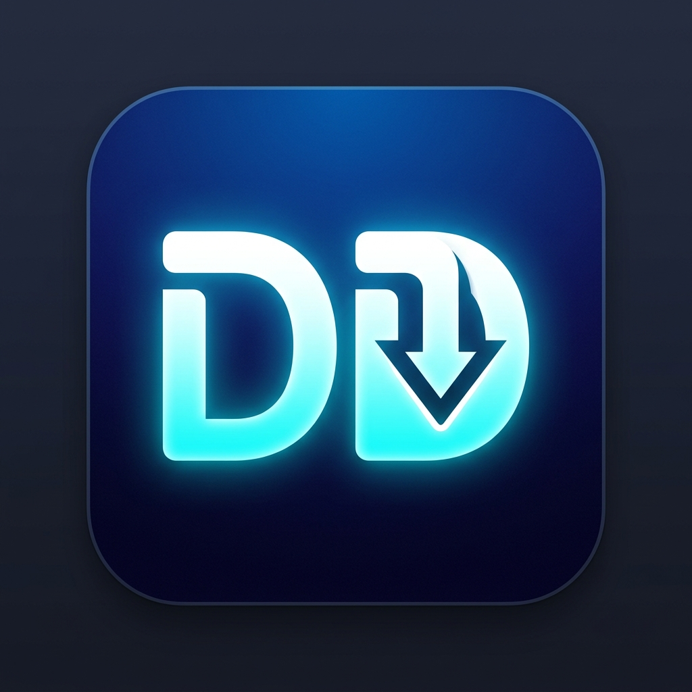
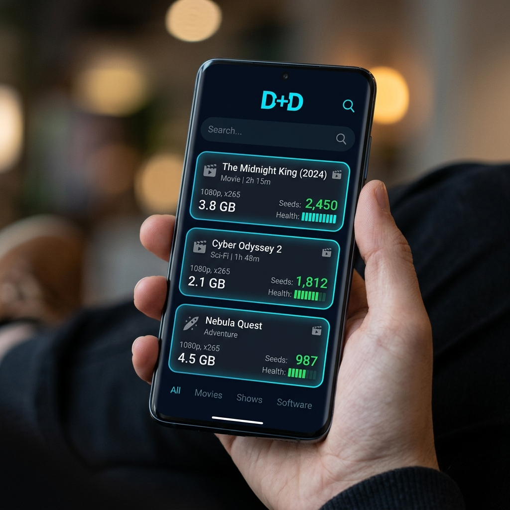
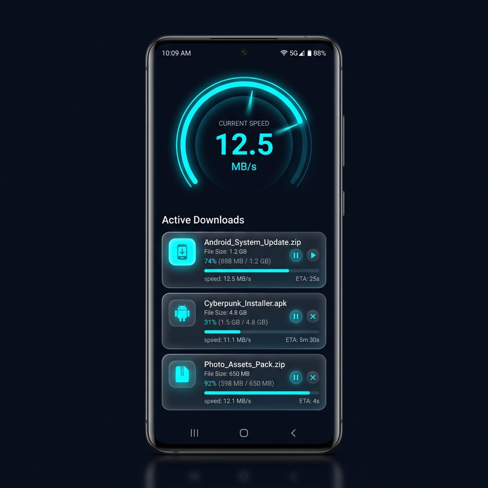

<p align="center">
  
</p>

<h1 align="center">DD — Deep Downloader</h1>

<p align="center">
  <strong>Download Smarter, Deeper.</strong>
</p>

<p align="center">
  <a href="https://github.com/SONUVERMA11/DD/releases/latest"></a>
  <a href="https://github.com/SONUVERMA11/DD/actions"></a>
  <a href="https://github.com/SONUVERMA11/DD"></a>
  <a href="https://sonuverma11.github.io/DD/"></a>
</p>

<p align="center">
  <a href="https://github.com/SONUVERMA11/DD/releases/latest">📦 Download APK</a> •
  <a href="https://sonuverma11.github.io/DD/">🌐 Website</a> •
  <a href="#-features">✨ Features</a> •
  <a href="#-architecture">🏗️ Architecture</a> •
  <a href="#-screenshots">📸 Screenshots</a>
</p>

---

## 🎯 What is DD?

**DD (Deep Downloader)** is a powerful, privacy-first Android torrent search & download client built entirely in **Kotlin** with **Jetpack Compose**. It aggregates results from **16 torrent search engines** in parallel, displays them with a beautiful dark UI, and manages downloads with a real-time speedometer gauge.

> **⚠️ Disclaimer:** DD is a search aggregator and download manager. Users are responsible for ensuring they comply with applicable copyright laws in their jurisdiction.

---

## ✨ Features

### 🔍 Search — 16 Engines, One Tap

| Engine | Type | Category |
|--------|------|----------|
| **YTS** | REST API | HD Movies |
| **1337x** | Scraper | General |
| **The Pirate Bay** | REST API | Everything |
| **EZTV** | Scraper | TV Shows |
| **Nyaa.si** | Scraper | Anime |
| **Academic Torrents** | Scraper | Research |
| **TorrentGalaxy** | Scraper | General |
| **LimeTorrents** | Scraper | General |
| **SolidTorrents** | REST API | Multi-category |
| **Bitsearch** | Scraper | Meta Search |
| **Knaben** | REST API | Database |
| **BTDigg** | Scraper | DHT Search |
| **Torrentz2** | Scraper | Meta Search |
| **GloTorrents** | Scraper | General |
| **MagnetDL** | Scraper | General |
| **TorrentProject** | Scraper | Multi-category |

All sources are queried **in parallel** on `Dispatchers.IO`, results are **deduplicated** by info hash, and **cached** in Room for 30 minutes.

---

### ⚡ Download Manager

- 🎯 **Real-time Speedometer** — Custom Canvas-drawn gauge with animated needle, gradient arcs, and live speed tracking
- 📊 **Progress Tracking** — Per-download progress bars, ETA, speeds, seeds/peers count
- ⏯️ **Controls** — Pause, resume, cancel individual or all downloads
- 📂 **Auto-save** — Files saved to `Downloads/DD/` and registered in **Android MediaStore** (visible in file manager & gallery)
- 🔔 **Foreground Service** — Downloads continue in background with notification controls
- 📱 **Open with any app** — Tap files to open with PDF viewer, video player, etc. via `Intent.ACTION_VIEW`

---

### 🎨 5 Stunning Themes

| Theme | Background | Accent |
|-------|-----------|--------|
| 🌙 **Midnight Dark** | `#0A0E1A` | `#00E5FF` (Cyan) |
| ⚫ **Contrast Dark** | `#000000` | `#BB86FC` (Purple) |
| ☁️ **Soft Light** | `#F5F5F7` | `#007AFF` (Blue) |
| 🍂 **Warm Sepia** | `#1C1410` | `#D4A574` (Gold) |
| 🌲 **Forest Green** | `#0A1A0F` | `#4CAF50` (Green) |

All transitions are animated with **300ms cubic-bezier easing**. Theme follows system dark mode or can be set manually.

---

### 🔒 Privacy & Security

- 🕶️ **Incognito Mode** — No search history saved
- 🔐 **App Lock** — Biometric authentication
- 🌐 **VPN Reminder** — Notification if VPN is not active
- 🚫 **No Analytics** — Zero tracking, zero telemetry
- 📡 **Anonymous DHT** — Privacy-respecting peer discovery

---

### 📚 Library

- Auto-categorizes downloads: **Videos**, **Music**, **Books**, **Images**, **Archives**
- Grid and List view modes
- Storage usage indicator
- Search history with clear option
- One-tap open with the correct system app

---

## 📸 Screenshots

<p align="center">
  
  &nbsp;&nbsp;&nbsp;
  
</p>

---

## 🏗️ Architecture

```
DD/
├── core/
│   ├── data/
│   │   ├── datastore/     # DDPreferences (50+ settings)
│   │   └── db/            # Room database, DAOs, entities
│   ├── domain/model/      # TorrentResult, DownloadState, FileCategory
│   ├── ui/
│   │   ├── components/    # BottomNav, SpeedometerGauge
│   │   ├── navigation/    # Routes, NavTypes
│   │   └── theme/         # 5 color schemes, typography, shapes
│   └── util/              # FileUtils, MagnetUriBuilder
├── feature/
│   ├── search/
│   │   ├── data/          # 16 data sources + aggregator
│   │   └── ui/            # SearchScreen, SearchResultsScreen
│   ├── download/
│   │   └── ui/            # DownloadViewModel, ActiveDownloadsScreen
│   ├── library/
│   │   └── ui/            # LibraryScreen, LibraryViewModel
│   ├── settings/
│   │   └── ui/            # SettingsScreen, SettingsViewModel
│   └── splash/            # Animated SplashScreen
├── service/               # DownloadForegroundService
└── di/                    # Hilt modules
```

### Design Patterns

| Pattern | Usage |
|---------|-------|
| **MVVM** | ViewModels with `StateFlow` for reactive UI |
| **Repository** | Data sources abstracted behind interfaces |
| **Clean Architecture** | Separated `data → domain → presentation` layers |
| **Dependency Injection** | Hilt for compile-time DI |
| **Observer** | Compose `collectAsStateWithLifecycle()` |

### Data Flow

```
User Search → SearchViewModel → TorrentSearchAggregator
                                       ↓
                            ┌──────────┴──────────┐
                            │  16 sources (async)  │
                            └──────────┬──────────┘
                                       ↓
                              Dedup + Sort by Seeds
                                       ↓
                              Cache in Room (30 min)
                                       ↓
                            SearchResultsScreen (UI)
                                       ↓
                            User taps → DownloadDetailScreen
                                       ↓
                            DownloadViewModel.addDownload()
                                       ↓
                         ┌─────────────┴─────────────┐
                         │  Save to Downloads/DD/    │
                         │  Register in MediaStore   │
                         │  Insert into Library DB   │
                         └───────────────────────────┘
```

---

## 🛠️ Tech Stack

| Category | Technology |
|----------|-----------|
| **Language** | Kotlin 100% |
| **UI** | Jetpack Compose + Material 3 |
| **Architecture** | MVVM + Clean Architecture |
| **DI** | Hilt |
| **Database** | Room |
| **Preferences** | DataStore |
| **Networking** | OkHttp + Retrofit + Jsoup |
| **Async** | Kotlin Coroutines + Flow |
| **Image Loading** | Coil |
| **Typography** | Plus Jakarta Sans + DM Sans |
| **Canvas** | Custom speedometer gauge |
| **CI/CD** | GitHub Actions |
| **Min SDK** | 26 (Android 8.0) |
| **Target SDK** | 34 (Android 14) |

---

## 🚀 Getting Started

### Download

Grab the latest APK from the [**Releases**](https://github.com/SONUVERMA11/DD/releases/latest) page.

### Build from Source

```bash
# Clone
git clone https://github.com/SONUVERMA11/DD.git
cd DD

# Build debug APK
./gradlew assembleDebug

# Build release APK
./gradlew assembleRelease

# APK location
ls app/build/outputs/apk/debug/app-debug.apk
```

### Requirements

- Android Studio Hedgehog (2023.1.1) or later
- JDK 17
- Android SDK 34

---

## 🔧 Configuration

DD offers **50+ configurable settings** via DataStore:

| Setting | Default | Description |
|---------|---------|-------------|
| Theme | Midnight Dark | 5 color schemes |
| Follow System | On | Auto dark/light mode |
| Max Concurrent Downloads | 3 | Parallel download limit |
| Wi-Fi Only | Off | Restrict to Wi-Fi |
| Auto-Save to Gallery | On | Register in MediaStore |
| Search Results Limit | 50 | Max results per query |
| Cache Duration | 30 min | Search cache lifetime |
| Incognito Mode | Off | Disable search history |
| VPN Reminder | Off | Alert if VPN inactive |
| Auto-Resume on Boot | On | Resume after restart |

---

## 📋 CI/CD Pipeline

Every push to `main` triggers two workflows:

1. **Build DD APK** — Compiles debug + release APKs, uploads as artifacts
2. **Deploy Website** — Publishes the landing page to GitHub Pages

```yaml
# Automated on every push
✓ Checkout → JDK 17 → Gradle Build → Debug APK → Release APK → Upload
```

---

## 🗺️ Roadmap

- [ ] Native LibTorrent4J integration (replace download simulation)
- [ ] FFmpeg-kit media conversion
- [ ] Proxy rotation for anti-bot protection
- [ ] Per-source enable/disable toggles for new engines
- [ ] Streaming preview before download completes
- [ ] Scheduled downloads
- [ ] Magnet URI deep link handling
- [ ] Android TV support

---

## 🤝 Contributing

Contributions are welcome! Please:

1. Fork the repository
2. Create a feature branch: `git checkout -b feature/amazing-feature`
3. Commit your changes: `git commit -m 'feat: add amazing feature'`
4. Push to branch: `git push origin feature/amazing-feature`
5. Open a Pull Request

---

## 📄 License

This project is open source. See the repository for license details.

---

## 👨‍💻 Author

**Sonu Verma**

- GitHub: [@SONUVERMA11](https://github.com/SONUVERMA11)
- Website: [sonuverma11.github.io/DD](https://sonuverma11.github.io/DD/)

---

<p align="center">
  Made with ❤️ by <strong>Sonu Verma</strong>
</p>

<p align="center">
  <a href="https://github.com/SONUVERMA11/DD/releases/latest">
    
  </a>
</p>
